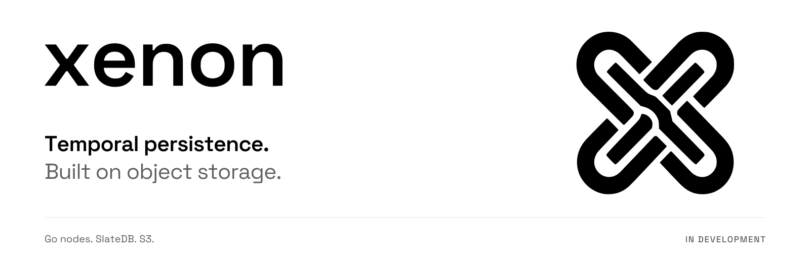

<picture>
  <source media="(prefers-color-scheme: dark)" srcset="assets/brand/banner-dark.svg">
  
</picture>

<p align="center">
  <a href="docs/design/technical.md">Technical design</a> ·
  <a href="docs/design/verification-matrix.md">Verification status</a> ·
  <a href="https://github.com/0x63616c/xenon/issues/1">Roadmap</a> ·
  <a href="docs/brand.md">Brand assets</a>
</p>

# Xenon

Experimental S3-backed persistence for Temporal.

The goal is an end-to-end proof with existing Temporal SDKs, Omes, visibility and Temporal UI, including dynamic storage-node scale-out and crash recovery with disposable local disks.

We are retaining Temporal Server and investigating a gRPC persistence adapter with partitioned storage nodes. SlateDB is a candidate, not a final choice. No working server or production-readiness claim exists yet.

Start with [the autonomous delivery handoff](docs/handoff-autonomous.md). Calum has delegated architecture and implementation decisions to coordinated agents using an advocate/reviewer debate and evidence-based validation. Progress is tracked through the [Wayfinder map](https://github.com/0x63616c/xenon/issues/1); see `docs/agents/issue-tracker.md` for tracker limitations.

Future direction: a professional open-source release; possible BYOC service. This repository is private during investigation.

## Executable checkpoint

The initial direct-S3 SlateDB primitive harness is implemented. This is **not yet a working Temporal backend**. Four engine tests and an S3-emulator write/reopen probe have passed; [evidence and limits](docs/evidence/primitive/README.md) distinguish these from the open shipping gates.

Requirements: Rust 1.94.0 (rustup reads the toolchain file); Docker Compose and AWS CLI for the local S3 probe.

```sh
make test
make probe-local
make stop
```

`make probe-local` starts a loopback-only MinIO instance with local test credentials and a retained Docker volume. `make stop` stops services while preserving object data. It neither uses nor validates a real AWS bucket.

Follow the [product specification](docs/design/product.md), [technical specification](docs/design/technical.md), and [requirement matrix](docs/design/verification-matrix.md) for implementation status. The repository remains private pending separate public-release authorization.
