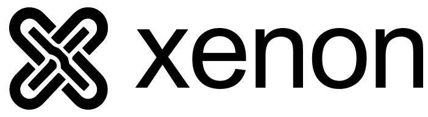

# Xenon brand



Xenon's mark is a single continuous rounded X: a black perimeter with an open
center, no crossing bars, and rounded arm ends and inward corners. Calum selected
this shape and the three-layer staggered loading motion in the logo editor.

Use black on white, or white on black. Preserve the geometry, aspect ratio,
clear space and lowercase Space Grotesk wordmark. Keep production marks static;
use the supplied animated variants for loading and intentional motion.

## Assets

| Use | Light surface | Dark surface |
| --- | --- | --- |
| Symbol | [SVG](../assets/brand/mark.svg) / [PNG](../assets/brand/mark.png) | [SVG](../assets/brand/mark-white.svg) / [PNG](../assets/brand/mark-white.png) |
| Symbol and wordmark | [SVG](../assets/brand/lockup.svg) | [SVG](../assets/brand/lockup-white.svg) |
| Wordmark | [SVG](../assets/brand/wordmark.svg) | [SVG](../assets/brand/wordmark-white.svg) |
| Repository banner | [SVG](../assets/brand/banner.svg) / [PNG](../assets/brand/banner.png) | [SVG](../assets/brand/banner-dark.svg) / [PNG](../assets/brand/banner-dark.png) |

Browser assets include `favicon.svg`, `favicon.ico` and `apple-touch-icon.png`.
The documentation site uses the same mark and favicon. Its dark endpoint panel
uses the white variant for contrast. Existing Space Grotesk wordmarks are retained.

## Approved shape and motion

| Setting | Default |
| --- | --- |
| Layers | 3 |
| Spoke width | 120% |
| Tip roundness | 85% |
| Inner corners | 54% |
| Disc thickness | 0.58 |
| Gap | 0, touching |
| Outline radius | 0.064 |
| Loop | 2.5 seconds |
| Stagger | 0.10 of a loop, 0.25 seconds per disc |
| Moving time | 75% of each loop |
| Easing | cubic-bezier(0.75, 0, 0.25, 1) |
| Direction | Anticlockwise |

The outlined static shape is the top view of the stack. The editor uses true
3D geometry with camera-dependent side outlines. The small loading assets use
SVG and CSS, so ordinary loading indicators do not require WebGL or Three.js.

## Editor and loading spinners

- [Standalone editor](../tools/logo-editor/index.html)
- [Editor source and usage](../tools/logo-editor/README.md)
- [Spinner gallery](../assets/brand/spinners/index.html)
- [Spinner usage](../assets/brand/spinners/README.md)
- [Machine-readable approved geometry](../assets/brand/shape.json)

Staggered, counter-rotating and continuous variants are included in black-on-white
and white-on-black. They respect `prefers-reduced-motion`. Use descriptive loading
text or an accessible status alongside real pending work; decorative animation
must not imply a running request or a healthy service.

## Rebuild

From the repository root:

```sh
node scripts/build-logo.mjs
python3 scripts/build-brand.py
npm run build --prefix website
```

`build-logo.mjs` uses only Node's standard library. It produces the canonical
`mark.svg`, site symbol, SVG spinners, approved settings and standalone editor.
`tools/logo-editor/editor.fragment.html` is the editable editor source.
`build-brand.py` derives the outlined wordmarks, lockups, banners, raster images
and favicons. It uses the existing bundled Space Grotesk font and fonttools
4.61.1, librsvg `rsvg-convert` 2.62.3, and ImageMagick 7.1.2-31.

The standalone editor imports pinned Three.js 0.180.0 from jsDelivr and its GLB
exporter from esm.sh. It loads Space Grotesk from Google Fonts. It runs without
Codex, but requires network access for those imports. All static logo and SVG
spinner assets work offline. Editor exports are static GLB poses and JSON motion
settings, not baked animated GLB files.

The repository and brand assets are public under the project's MIT license.
Branding does not imply production readiness; retain visible development status.

## Primary animated identity

The original Counter spinner, white on black, is the selected website logo and loading indicator. `assets/brand/logo.svg` and `assets/brand/loader.svg` are generated from `spinners/counter-white.svg`; `banner-counter.svg` supplies the README header. Counter retains its 20% speed increase and top-to-bottom start order. Counter v2 remains an optional experiment. All animated SVGs respect reduced-motion preferences. The favicon retains the static rounded-X mark for small-size clarity.
